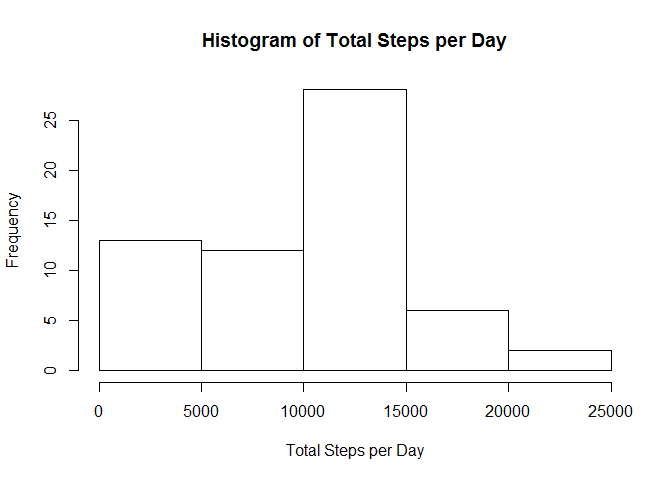
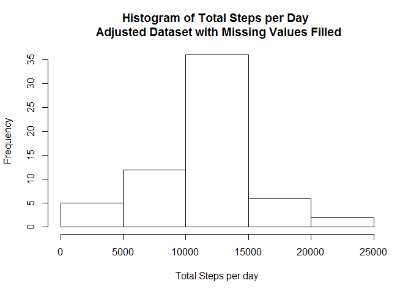
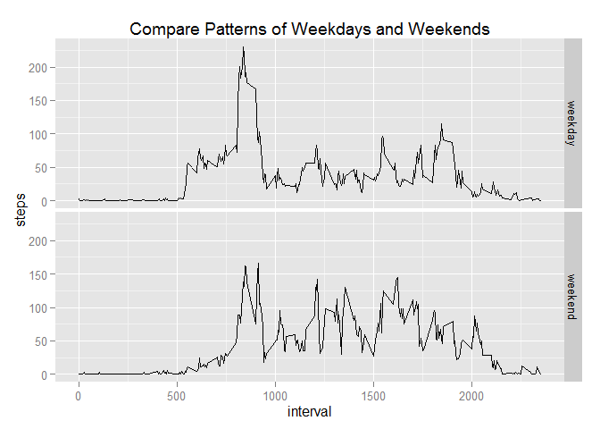

# Reproducible Research: Peer Assessment 1


## Loading and preprocessing the data

```r
library(dplyr)
act <- read.csv("activity.csv")
act_tbl <- tbl_df(act)
rm(act)
```

## What is mean total number of steps taken per day?

```r
# Note: NA are ignoared for this part of assignment
# calculate total steps per day
stepsPerDay <- act_tbl %>%
        group_by(date) %>%
        summarize(totalSteps = sum(steps, na.rm = T))
stepsPerDay
```

```
## Source: local data frame [61 x 2]
## 
##          date totalSteps
## 1  2012-10-01          0
## 2  2012-10-02        126
## 3  2012-10-03      11352
## 4  2012-10-04      12116
## 5  2012-10-05      13294
## 6  2012-10-06      15420
## 7  2012-10-07      11015
## 8  2012-10-08          0
## 9  2012-10-09      12811
## 10 2012-10-10       9900
## ..        ...        ...
```

```r
# draw histogram of total steps per day
hist(stepsPerDay$totalSteps, main = "Histogram of Total Steps per Day", xlab = "Total Steps per Day")
```

 

```r
# calculate mean and median of total steps per day
meanSteps <- mean(stepsPerDay$totalSteps, na.rm = T)
medianSteps <- median(stepsPerDay$totalSteps, na.rm = T)
```
The mean of total steps per day is 9354.2295082.
The median of total steps per day is 10395.

## What is the average daily activity pattern?

```r
# calculate average number of steps taken, across all days
stepsPerInterval <- act_tbl %>%
        group_by(interval) %>%
        summarize(steps = mean(steps, na.rm = T))
stepsPerInterval
```

```
## Source: local data frame [288 x 2]
## 
##    interval     steps
## 1         0 1.7169811
## 2         5 0.3396226
## 3        10 0.1320755
## 4        15 0.1509434
## 5        20 0.0754717
## 6        25 2.0943396
## 7        30 0.5283019
## 8        35 0.8679245
## 9        40 0.0000000
## 10       45 1.4716981
## ..      ...       ...
```

```r
# draw time series chart, intervals vs. steps
library(ggplot2)
qplot(interval, steps, data = stepsPerInterval, geom = c("line"))
```

 

```r
maxSteps = max(stepsPerInterval$steps)
maxStepsInterval = stepsPerInterval$interval[which(stepsPerInterval$steps == maxSteps)]
```
The maximum number of steps averaged across all the days takes place at the 835-840 5-min interval.

## Imputing missing values

```r
# calculate total number of missing values
numMissing = sum(is.na(act_tbl$steps))
```
The total numbe of missing values in the original dataset is 2304.

```r
# fill in missing values with mean of the interval
actNAFilled_tbl <- act_tbl
for(i in 1:nrow(actNAFilled_tbl)) {
        if(is.na(actNAFilled_tbl$steps[i])) {
                actNAFilled_tbl$steps[i] <- 
                        stepsPerInterval$steps[
                                stepsPerInterval$interval == actNAFilled_tbl$interval[i]]
        }
}
numMissing2 = sum(is.na(actNAFilled_tbl$steps))
```
After filled in missing values with mean of the interval, the total number of missing values in the adjusted dataset is 0.

```r
# draw historgram of new dataset
stepsPerDay2 <- actNAFilled_tbl %>%
        group_by(date) %>%
        summarize(totalSteps = sum(steps))
stepsPerDay2
```

```
## Source: local data frame [61 x 2]
## 
##          date totalSteps
## 1  2012-10-01   10766.19
## 2  2012-10-02     126.00
## 3  2012-10-03   11352.00
## 4  2012-10-04   12116.00
## 5  2012-10-05   13294.00
## 6  2012-10-06   15420.00
## 7  2012-10-07   11015.00
## 8  2012-10-08   10766.19
## 9  2012-10-09   12811.00
## 10 2012-10-10    9900.00
## ..        ...        ...
```

```r
# draw histogram of total steps per day
hist(stepsPerDay2$totalSteps, main = "Histogram of Total Steps per Day \n Adjusted Dataset with Missing Values Filled", xlab = "Total Steps per day") 
```

 

```r
# calculate mean and median of total steps per day
meanSteps2 <- mean(stepsPerDay2$totalSteps, na.rm = T)
medianSteps2 <- median(stepsPerDay2$totalSteps, na.rm = T)
```
The mean of total steps per day of the adjusted dataset is 1.0766189\times 10^{4}. It is 1411.959171 steps more than the original dataset.
The median of total steps per day of the adjusted dataset is 1.0766189\times 10^{4}. It is 371.1886792 steps more than the original dataset.

It can be seen after the missing values are filled, the estimate of total daily number of steps is increased.
The histogram also shows that after the missing values are filled, a more bell-shaped distribution is obtained.

## Are there differences in activity patterns between weekdays and weekends?

```r
# add a factor variable to hold weekday/weekend in data frame
actNAFilled_tbl <-
        actNAFilled_tbl %>%
        mutate(date = as.Date(date)) %>%
        mutate(day = factor("weekday", levels = c("weekday", "weekend")))
# set the weekday/weekend value according to date
for(i in 1:nrow(actNAFilled_tbl)) {
        wday <- weekdays(actNAFilled_tbl$date[i])
        if(wday == "Saturday" | wday == "Sunday") {
                actNAFilled_tbl$day[i] <- "weekend"
        }
}
# calculate average number of steps taken of each 5-min interval across all weekday and weekend
stepsPerInterval2 <-
        actNAFilled_tbl %>%
        group_by(interval, day) %>%
        summarise(steps = mean(steps))
# draw chart to compare weekday and weekend pattern
qplot(interval, steps, data = stepsPerInterval2, geom = c("line"), facets = day~., main = "Compare Patterns of Weekdays and Weekends") 
```

 

Below are some observations from the chart:

- The person is more active (i.e. more steps) at early morning on weekdays than on weekends. The person is more active at late night on weekends than on weekdays. This probably means that the person gets up earlier on weekdays than on weekends, while goes to bed later on weekends than weekdays.

- Peak steps are observed during ealier afternoon (about 1:30pm to 3:00pm) for both weekdays and weekends. But the chart shows that the number of steps during peak steps is higher on weekdays than on weekends. 
